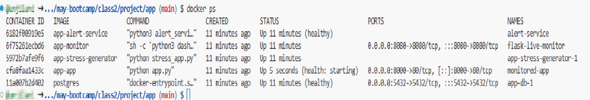
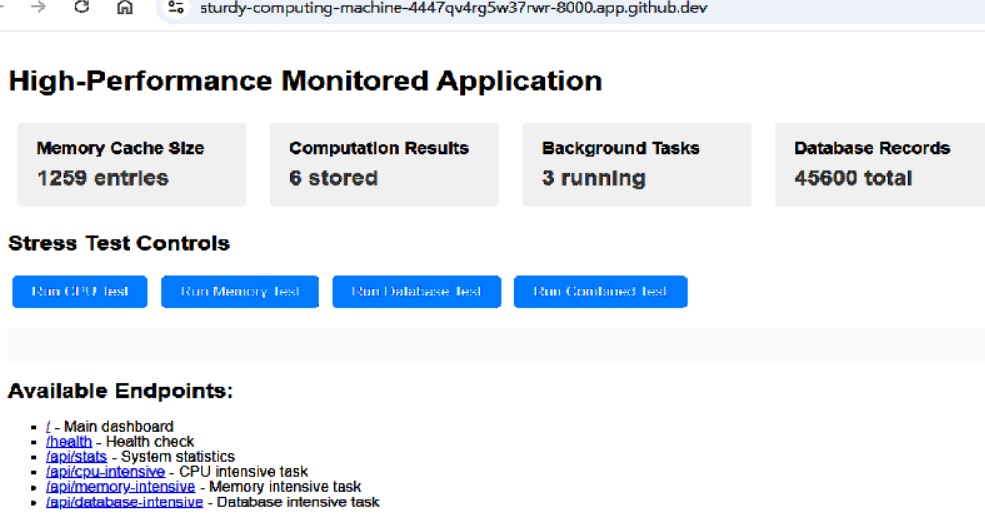
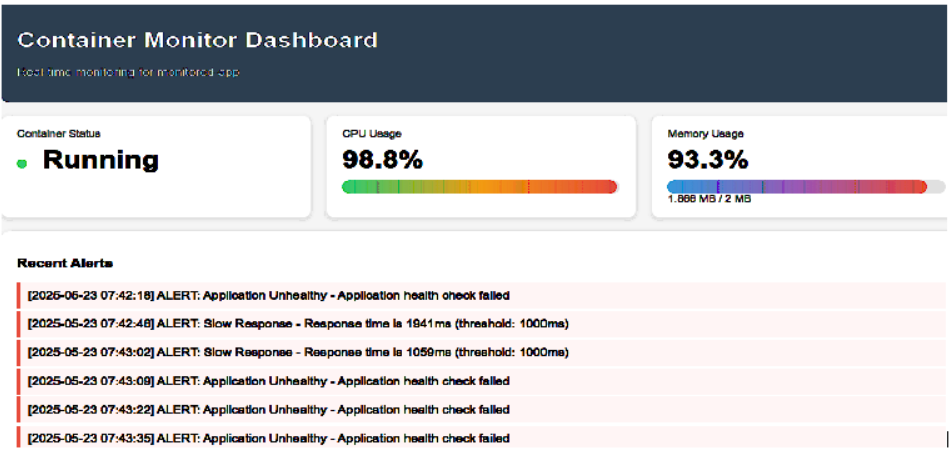
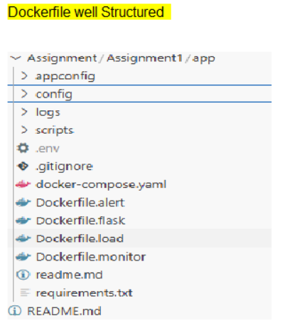
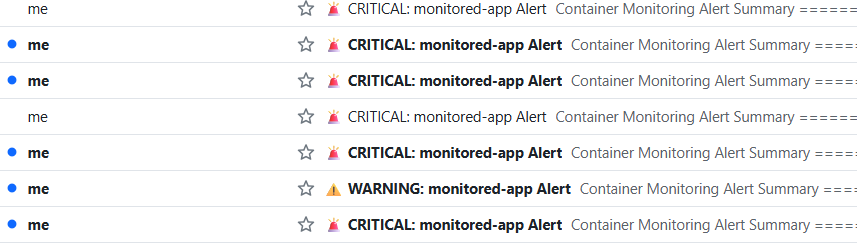

**My Assignment 1 for monitoring the Application running on Docker 
**

docker-compose up --build

# or 

docker-compose up -d

# Access the app

Main application: http://localhost:8080

Monitoring dashboard: http://localhost:8000

# Log rotation

logrotate -v /workspaces/bootcamp16week/Assignment/Assignment1/app/config/logrotate.conf

# Docker services 

# Application monitoring 

# Dashboard Monitoring 

# Log rotation 

# Sturctured 

# Email notification received 

 
